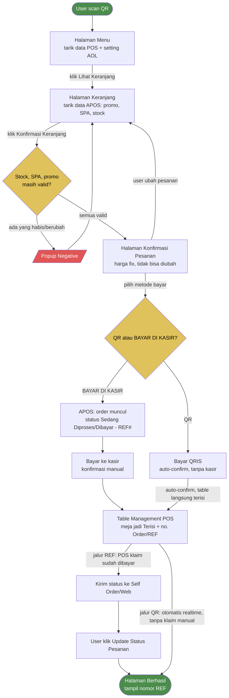

# Self Order — Alur Keranjang s.d. Berhasil (draft, perlu konfirmasi)

> Prasyarat: setting AOL sudah selesai.
> Simbol: stadium (start/end), diamond (keputusan), rectangle (proses/halaman).

![[Pasted image 20260804012203.png]]
## Catatan
- **Jalur REF**: APOS munculin order → kasir konfirmasi manual → table terisi → POS klaim dibayar → user klik update status → Berhasil.
- **Jalur QR (QRIS)**: auto-confirm, gak lewat kasir, table langsung terisi → langsung Berhasil (gak perlu klik update status).
- REF# jadi penanda pesanan, ditampilkan di: POS (Detail Meja Terisi) & Self Order (halaman Konfirmasi/Berhasil).
- Versi Canvas (drag-bebas, tapi cuma kotak — gak ada simbol diamond/stadium asli) masih ada di [[SO_Flow_KonfirmasiBayar.canvas]] kalau butuh reposisi manual.
