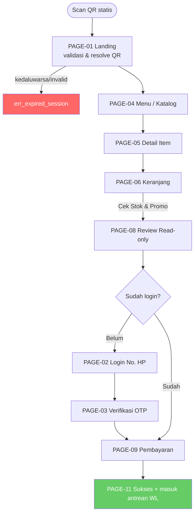
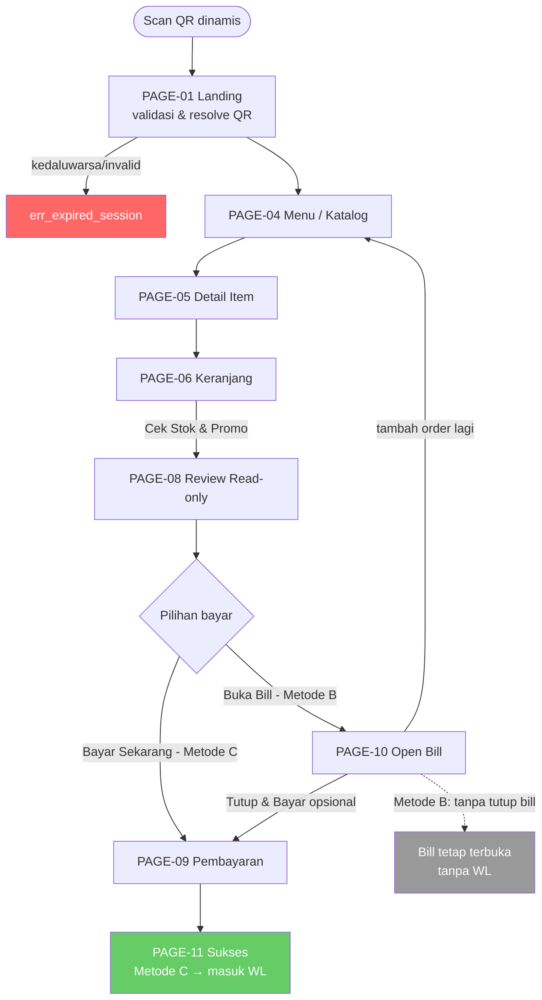

# Self Order — Flowchart (Scan QR → Checkout)

> Sumber alur: [[SO_PRD#5. Page Map|SO_PRD § Page Map]] & [[SO_PRD#5.1|Alur per Metode]]. Update di sini kalau page map berubah.
> Dipecah 2 diagram (statis / dinamis) biar tiap diagram muat 1 layar.

## Alur A — QR Statis (login + bayar di muka)

- Login HP+OTP dipicu deferred, cuma pas checkout (belum login).
- Bayar di muka wajib. Sukses → masuk WL.

## Alur B & C — QR Dinamis (open bill / bayar di muka)

- **Metode C**: "Bayar Sekarang" → langsung bayar, sukses → masuk WL.
- **Metode B**: "Buka Bill" → open bill, bisa tambah order berkali-kali, "Tutup & Bayar" opsional → baru ke pembayaran. Tanpa handoff WL.

## Catatan
- Detail tiap page, copy, & acceptance criteria ada di [[SO_PRD]].
- Kalau butuh drag/reposisi manual bebas (bukan auto-layout), pindah ke Obsidian Canvas (`.canvas`) — bilang aja kalau mau dibikinin versi itu.
